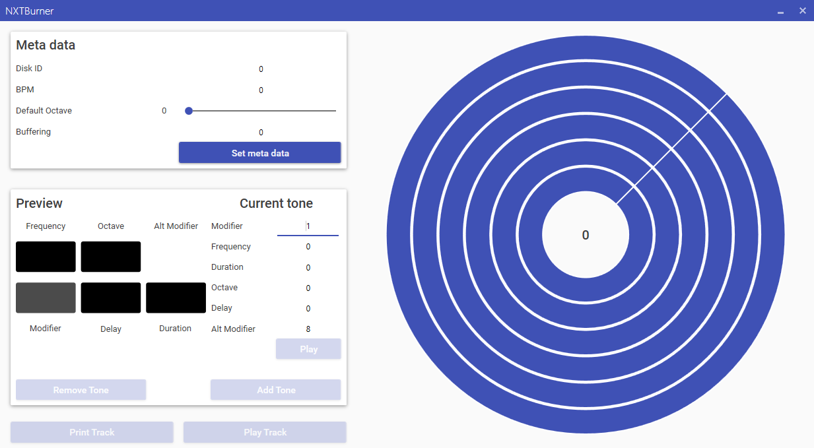

# NXTBurner
A tool used to create NXTDisks for the [NXTPlayer](https://github.com/CiriousJoker/NXTPlayer).

## Screenshot

## Installation

[Click here](https://github.com/CiriousJoker/NXTBurner/releases/latest) to go to the latest release here on Github.
This software itself requires no installation, however, to playback the generated NXTDisks you need the [NXTPlayer](https://github.com/CiriousJoker/NXTPlayer).

## Legal

This sourcecode is licensed under the [MIT license](LICENSE).
